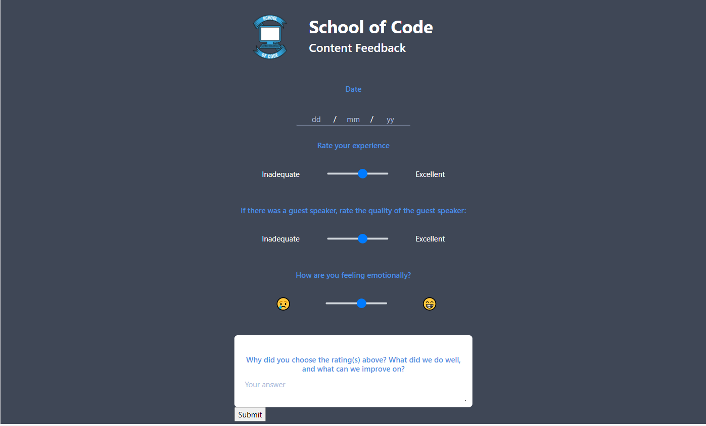

# Feedback form helper app - School Of Code one week project

This repo is one of two that were created for version control and deployment of an app created for the [School Of Code](http://www.schoolofcode.com) project week in January 2022. This is the repo for our backend, you can find the [frontend repo here](https://github.com/ozzyee/one-week-project-app).

## The task

Our task was to create something to improve the life of the bootcampers at the School Of Code. After coming together as a team and agreeing on our basic workflows and team values, we proceeded to brainstorm ideas using the [Disney ideation](https://www.designorate.com/disneys-creative-strategy/) method. After working through the 3 phases of dreamer, realist, and critic we landed upon a shortlist of ideas that we thought could be

1.  realistically achieved in the time allowed,
2.  beneficial to the bootcampers in a meaningful way, and
3.  make use of the workflows, tools, and technologies we'd been learning on the bootcamp.

Our next step was interview our fellow students and sense-check that our ideas would be useful to them, that we'd be making not only a good product, but the right product for the task at hand (i.e. to benefit the bootcampers). In this research phase we confirmed that our favorite idea from the shortlist was the most suitable and stood the best chance of being succesful.

## The problem

The coaches and team at School Of Code send out twice daily feedback forms for the students to fill out - an opportunity for the students to leave feedback and for the coaches to gain insight into the general mood and thoughts of the bootcampers as a whole. Although most of the similar processes are well streamlined, the feedback forms completion process was slightly more cumbersome. The name, email, bootcamper ID and date fields needed to be entered manually each time, and the bootcamper ID in particular was problematic - a long string of random characters that was originally only to be found in the original student application emails. The Google forms used to collect data, whilst effective, were not particularly pleasant to use, and did not fit the overall aesthetic of other School Of Code documents. We felt this was an area of the overall bootcamper experience that we could improve on.  

## Our solution

Our solution to this problem was an app that bootcampers could sign up to and enter their details with just once, taking them to a dashboard that would show them any forms not yet filled out. Clicking on the forms in the list would then take them to a custom designed form page that would in turn pass the data to the relevant Google forms API - ensuring that the data collection processes and workflow for the coaches would remain unchanged.

## Design, planning, and workflow

We used a Kanban board on Trello for collaborative planning and progress monitoring, and found it a valuable tool, particularly when we occasionally worked asynchronously on different parts of the project.

Our initial plan proposed various more complex features, but with the time constraints imposed on us by the nature of the project, we soon whittled these down to an MVP and designated any extra features as stretch goals.
We quickly wireframed and then designed some high fidelity mockups using Figma, and it was at this point that the project started to come to life. These early mockups were invaluable throughout the rest of the project, and spending some time getting this stage right really helped us proceed with purpose through the rest of the week.

Following Agile methodology on our own small scale, we tracked progress and adjusted plans through daily morning standups and late-afternoon retrospectives as a team.  
As much as possible we used pair-programming so that we could all familiarise ourselves with the different sections of the codebase, and for all the usual benefits such as shorter feedback loops, increased creativity, and greater team/code resiliency.

## Technologies

This app makes use of Firebase for user authentication, React on the front end, Express on the backend, and PostgresSQL for the database. We also mixed in a pinch of Bootstrap for a component or two.

As mentioned previously, the codebase was split across two Git repos - frontend and backend - which were set up to continually auto-deploy to Netlify and Heroku respectively. In practice this meant that as soon as any changes were pushed to the main branch of either repo, the deployment would be rebuilt and re-deployed instantly - a small scale version of the CI/CD workflow that is a key part of modern Agile development.

The backend server code was setup with the aid of the [Express Generator ES Modules](https://www.npmjs.com/package/express-generator-esmodules) npm package - a very handy time saver when working on such a tight deadline, and authored by School Of Code's very own main man - Chris Meah. The structure of the code follows for the most part the workflows we learned and practiced on the bootcamp - with logic and SQL queries seperated out to a seperate models folder, and server routes and request handlers in another folder.

The database itself utilised two tables - one for users, and one for forms.

Google's Firebase was used for authentication on the frontend.

## Blockers and retrospective

Although we felt the project went pretty well overall, there were a few blockers that slowed us down and led to some hair-pulling through the week;

- Bootstrap CSS overides
- Authentication lockouts
- Merge conflicts
- Deployment bugs during the build process

Although these were not all trivial problems, they did not compare to the main problem we faced - the time constraint. We all felt that given even just a couple of more days, we could have improved upon our MVP and got something we could be even more proud of. Despite this, the project was a tremendous learning experience, and we as a team were really happy with what we managed to produce after only 8 weeks on the bootcamp.

